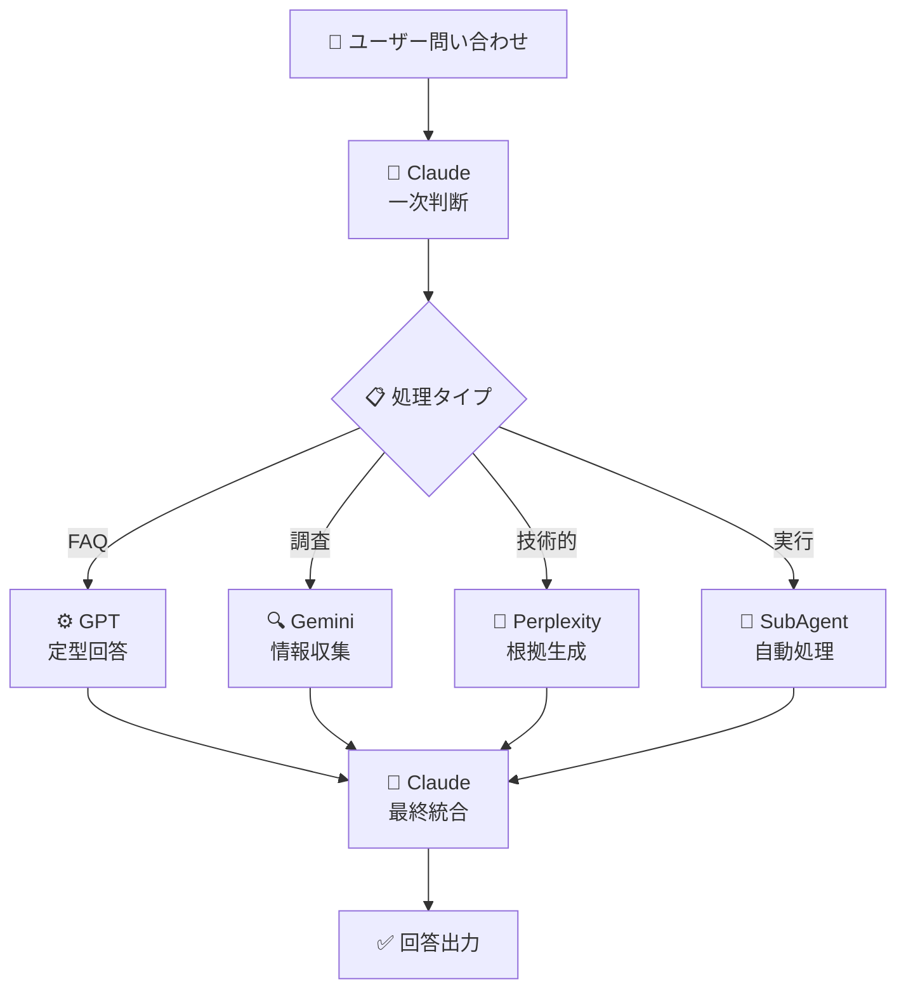

# 🏷️ Enterprise-IT-Helpdesk-AI

🤖 **社内IT・情シス向け インテリジェントヘルプデスクボット**

[](https://github.com/Kensan196948G/Enterprise-IT-Helpdesk-AI)
[](LICENSE)
[](https://opencode.ai)

---

## 📋 プロジェクト概要

🎯 **Enterprise IT Helpdesk AI** は、企業内のITサポート業務を支援する高度なAIボットシステムです。複数のAIエージェントが連携して、IT問い合わせの自動対応、運用支援、問題解決を実現します。

💡 **主な目的**: 情シス担当者の業務効率化と24時間対応可能なITサポート体制の構築

---

## ⭐ 主な特徴

### 🖥️ **クロスプラットフォーム対応**
- ✅ **Ubuntu Linux** 完全対応
- ✅ **Windows 11** 完全対応
- ✅ **macOS** 対応予定
- 🔄 **Dockerコンテナ** 対応

### 💻 **CLI中心設計**
- 🎮 **コマンドライン優先**: GUI依存なし
- ⚡ **高速処理**: 直接的な操作性
- 🔧 **自動化**: スクリプト連携可能
- 🛡️ **セキュリティ**: 権限管理が容易

### 👥 **高度な役割分担システム**
- 🤖 **Claude**: 最終判断と回答生成
- ⚙️ **GPT**: 定型処理と構造化出力
- 🔍 **Gemini**: 調査と情報整理
- 🧠 **Perplexity**: 出典付き根拠生成
- 🔧 **7体のSubAgent**: 専門分野ごとの自動処理

### 🏗️ **OpenCode統合**
- 🤖 **全SubAgent機能**: 7体構成の専門エージェント
- 🔄 **並列実行開発**: コンフリクト防止付き
- 🌳 **Git WorkTree**: AI連携開発環境
- 🔧 **MCPツール**: 8つの外部連携ツール

---

## 🏛️ システムアーキテクチャ



### 🎯 **AIエージェント役割分担**

| 🤖 エージェント | 🎨 役割 | 🛠️ 主な機能 |
|---------------|---------|-------------|
| **Claude** | 🧠 指揮官 | 判断・統合・最終回答 |
| **GPT** | ⚙️ 作業員 | 定型生成・データ整形 |
| **Gemini** | 🔍 調査員 | 情報収集・要約整理 |
| **Perplexity** | 📚 証拠係 | 出典付き・根拠提示 |

---

## 🚀 機能一覧

### 🤖 **インテリジェント問い合わせ対応**
- 🎯 **一次切り分け**: FAQ/インシデント/調査の自動分類
- 💬 **自然言語理解**: 日本語・英語対応
- 🧠 **文脈把握**: 会話履歴の考慮
- ⚡ **即時回答**: 高速レスポンス

### 🔧 **自動運用支援**
- 📊 **ログ分析**: システムログの自動解析
- 🚨 **アラート対応**: 異常検知と通知
- 📋 **手順生成**: トラブルシューティングガイド作成
- 🔄 **自動化**: 定期作業の自動実行

### 👥 **チーム連携機能**
- 📝 **エスカレーション**: 適切な担当者への自動振り分け
- 📊 **レポート生成**: 対応履歴と統計レポート
- 🎯 **学習機能**: 過去対応からの改善
- 🔄 **フィードバック**: 品質向上のための学習サイクル

### 🛡️ **セキュリティ・監査対応**
- 🔒 **アクセス制御**: 権限ベースの情報開示
- 📋 **監査ログ**: 全操作のログ記録
- 🛡️ **データ保護**: 機密情報の適切な扱い
- ✅ **コンプライアンス**: 企業ルール遵守

---

## 📦 インストール & セットアップ

### 🔧 **前提条件**
- 🖥️ **OS**: Ubuntu Linux / Windows 11
- 🐍 **Node.js**: v18.0 以上
- 🐳 **Docker**: (任意、コンテナ実行時)
- 🔑 **APIキー**: OpenAI, Anthropic, Google (各サービス用)

### 🚀 **クイックスタート**

```bash
# 1. リポジトリクローン
git clone https://github.com/Kensan196948G/Enterprise-IT-Helpdesk-AI.git
cd Enterprise-IT-Helpdesk-AI

# 2. 依存関係インストール
npm install

# 3. 環境設定
cp .env.example .env
# .envファイルを編集してAPIキーを設定

# 4. OpenCode設定確認
./verify-opencode-config.sh

# 5. 起動
npm start
```

### ⚙️ **詳細設定**

📖 **詳細なセットアップ手順**: [docs/01_プロジェクト概要（README）.md](docs/01_プロジェクト概要（README）.md)

---

## 💻 使用方法

### 🎮 **基本操作**

```bash
# ヘルプ表示
./helpdesk-ai --help

# 問い合わせ対応開始
./helpdesk-ai start

# 特定のトピックでの支援
./helpdesk-ai assist --topic "network-issue"

# ログ分析
./helpdesk-ai analyze --log "/path/to/logfile"
```

### 🤖 **AIエージェント活用**

```bash
# Claudeエージェント使用
./helpdesk-ai claude "ネットワーク接続の問題を解決してください"

# GPTエージェント使用
./helpdesk-ai gpt --template "incident-report"

# SubAgent実行
./helpdesk-ai subagent code-implementer --task "bug-fix"
```

### 🔄 **並列開発モード**

```bash
# WorkTree作成と並列開発開始
./helpdesk-ai worktree create feature/new-ui --agents 3

# コンフリクト防止付きマージ
./helpdesk-ai worktree merge --conflict-resolution auto
```

---

## 📚 ドキュメント

### 📖 **主要ドキュメント**
- 📋 [**プロジェクト概要**](docs/01_プロジェクト概要（README）.md) - 詳細な概要と特徴
- 🤖 [**AIエージェント構成**](docs/02_3つのAIエージェント（3AI Claude ChatGPT Gemini）.md) - AIモデル構成
- 👥 [**役割分担システム**](docs/03_AIボット役割分担（AI Bot Roles）.md) - エージェント役割
- 💭 [**回答ロジック**](docs/04_AIボット回答ロジック（AI Bot Answer Logic）.md) - 処理フロー
- 🧠 [**AI役割詳細**](docs/05_AI役割（AI Roles）.md) - 各AIの専門性
- 🚀 [**プロジェクト開始**](docs/06_プロジェクト開始（Project KickOff）.md) - 開発計画
- 🔧 [**エージェントガイド**](docs/07_エージェントガイドライン（AGENTS）.md) - 開発ガイドライン

### 🛠️ **技術ドキュメント**
- ⚙️ [**OpenCode設定**](opencode-config.json) - 環境設定
- 🧪 [**テストスクリプト**](comprehensive-test.sh) - 機能検証
- 🔍 [**検証ツール**](verify-opencode-config.sh) - 自動チェック

---

## 👨‍💻 開発情報

### 🏗️ **プロジェクト構成**
```
Enterprise-IT-Helpdesk-AI/
├── 📁 docs/                 # 📚 プロジェクトドキュメント
├── 📁 .opencode/           # 🤖 AIエージェント設定
│   └── 📁 agent/           # 🔧 SubAgent定義
├── ⚙️ opencode-config.json  # 🔧 OpenCode設定
├── 🧪 comprehensive-test.sh # ✅ 総合テスト
├── 🔍 verify-opencode-config.sh # ✅ 検証スクリプト
└── 📋 README.md           # 📖 このファイル
```

### 🧪 **テスト & 品質管理**
- ✅ **自動テスト**: 全機能の継続的検証
- 🧪 **品質チェック**: コード品質とセキュリティ
- 📊 **パフォーマンス**: 応答速度と効率監視
- 🔄 **継続的改善**: フィードバックによる改善

### 🤝 **貢献方法**

1. 🍴 **Fork** このリポジトリ
2. 🌿 **Branch** 作成: `git checkout -b feature/amazing-feature`
3. 💾 **Commit** 変更: `git commit -m 'Add amazing feature'`
4. 📤 **Push**: `git push origin feature/amazing-feature`
5. 🔄 **Pull Request** 作成

### 📋 **開発ルール**
- 🎯 **Issue駆動**: 全ての変更にIssueを関連付け
- ✅ **テスト必須**: 新機能にはテストコードを追加
- 📚 **ドキュメント**: 変更時はドキュメント更新
- 🔄 **レビュー**: 全PRにコードレビューを実施

---

## 📜 ライセンス

📄 **MIT License** - 詳細は [LICENSE](LICENSE) ファイルを参照

---

## 📞 サポート & お問い合わせ

- 📧 **Email**: support@enterprise-it-helpdesk.ai
- 🐛 **Issue**: [GitHub Issues](https://github.com/Kensan196948G/Enterprise-IT-Helpdesk-AI/issues)
- 📖 **Wiki**: [プロジェクトWiki](https://github.com/Kensan196948G/Enterprise-IT-Helpdesk-AI/wiki)

---

## 🎉 私たちについて

💼 **Enterprise IT Helpdesk AI** は、情シス担当者の業務効率化とユーザー満足度の向上を目指して開発されています。

🌟 **ビジョン**: AI技術を活用して、企業のITサポートをよりスマートで信頼できるものに進化させる

### 👥 **開発チーム**
- 🤖 **AIアーキテクト**: Claude & GPT連携システム設計
- 🔧 **エンジニア**: クロスプラットフォーム対応
- 🎨 **UX/UI**: 直感的なインターフェース設計
- 🧪 **QA**: 品質保証とテスト自動化

---

<div align="center">

**🚀 Enterprise IT Helpdesk AI - 未来のITサポートを、今。**

*Made with ❤️ for IT professionals worldwide*

[](https://github.com/Kensan196948G/Enterprise-IT-Helpdesk-AI)
[](https://github.com/Kensan196948G/Enterprise-IT-Helpdesk-AI)

</div>